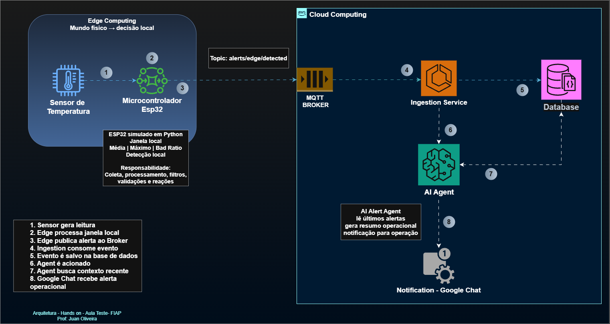

# Arquiteturas IoT baseadas em Edge, Fog e Cloud Computing

Demo hands-on para aula teste da FIAP para Disciplina Edge Computing & Computer Systems

## Objetivo

Esta demo mostra como aplicar **Edge Computing** em um cenário IoT para detectar falhas em sensores antes de enviar todos os dados para a cloud.

O cenário simula um sensor de temperatura que deveria operar entre **20°C e 35°C**, mas começa a gerar leituras anormais, como **180°C, 190°C e 200°C**.

A borda mantém uma janela local de leituras, calcula estatísticas simples e publica um alerta MQTT apenas quando identifica um padrão consistente de falha.

A ideia central é:

> A borda filtra, valida e reage. A cloud armazena. O agente transforma o evento técnico em ação operacional.

---

## Arquitetura da demo

```text
Edge Device Simulator
→ janela local de leituras
→ detecção de falha na borda
→ MQTT / EMQX
→ Ingestion Service
→ JSONL simulando MongoDB/STH
→ AI Alert Agent
→ Google Chat
```

### Papel de cada componente

| Componente | Responsabilidade |
|---|---|
| `edge_device_simulator.py` | Simula o dispositivo IoT, mantém uma janela local e detecta padrão de falha na borda |
| `mqtt_ingestion_service.py` | Assina o tópico MQTT, recebe o alerta, normaliza o evento e simula persistência |
| `ai_alert_agent.py` | Busca contexto recente, simula uma LLM, gera resumo operacional e envia notificação |
| `docker-compose.yml` | Sobe o broker MQTT EMQX localmente |
| `data/alerts.jsonl` | Simula o armazenamento em MongoDB/STH |

---

## Fluxo da demonstração

1. O simulador gera leituras normais de temperatura.
2. Depois de algumas leituras, o sensor começa a retornar valores anormais.
3. A borda mantém uma janela local com as últimas leituras.
4. A borda calcula:
   - média da janela;
   - valor máximo;
   - quantidade de leituras fora da faixa;
   - percentual de leituras fora da faixa.
5. Quando há padrão de falha, a borda publica um único alerta MQTT.
6. O ingestion service recebe o alerta e salva o evento.
7. O AI Agent gera uma mensagem operacional e envia para o Google Chat.
8. O terminal exibe métricas simples de observabilidade do agente.

### Desenho Arquitetural

---

## Critério de detecção na borda

A borda gera alerta quando a janela local atende aos seguintes critérios:

```text
janela completa
E média da temperatura > 60°C
E pelo menos 40% das leituras fora da faixa válida
```

Faixa válida do sensor:

```text
20°C a 35°C
```

Exemplo de leituras anormais:

```text
180°C, 190°C, 200°C
```

A regra foi mantida simples de propósito para fins didáticos.

---

## Estrutura do projeto

```text
fiap-edge-iot-hands-on/
├── docker-compose.yml
├── pyproject.toml
├── uv.lock
├── README.md
├── .env.example
├── .gitignore
└── src/
    ├── edge/
    │   └── edge_device_simulator.py
    ├── cloud/
    │   └── mqtt_ingestion_service.py
    └── agent/
        └── ai_alert_agent.py
```

Arquivos gerados em execução:

```text
data/
└── alerts.jsonl
```

A pasta `data/` não deve ser versionada no Git.

---

## Pré-requisitos

- Python 3.10+
- Docker
- Docker Compose
- uv

Instalação do `uv`, se necessário:

```bash
pip install uv
```

---

## Configuração do ambiente

Crie o arquivo `.env` a partir do exemplo:

```bash
cp .env.example .env
```

Conteúdo esperado do `.env.example`:

```env
MQTT_HOST=localhost
MQTT_PORT=1883
MQTT_TOPIC_ALERTS=alerts/edge/detected

# Opcional.
# Se não estiver configurado, o agente imprime a notificação no terminal.
GOOGLE_CHAT_WEBHOOK_URL=
```

Caso queira enviar a mensagem para o Google Chat, configure a variável:

```env
GOOGLE_CHAT_WEBHOOK_URL=https://chat.googleapis.com/v1/spaces/...
```

Nunca suba o arquivo `.env` para o GitHub.

---

## Como executar

### 1. Subir o broker MQTT

```bash
docker compose up -d
```

Verifique se o EMQX está rodando:

```bash
docker ps
```

A porta MQTT deve estar exposta em:

```text
1883
```

O dashboard do EMQX fica em:

```text
http://localhost:18083
```

Observação:

```text
1883  = comunicação MQTT
18083 = dashboard web do EMQX
```

---

### 2. Rodar o ingestion service

Em um terminal:

```bash
uv run python src/mqtt_ingestion_service.py
```

Saída esperada:

```text
Starting MQTT ingestion service...
Connected to MQTT broker at localhost:1883
Subscribing to topic: alerts/edge/detected
```

Esse serviço fica aguardando mensagens MQTT.

---

### 3. Rodar o simulador de borda

Em outro terminal:

```bash
uv run python src/edge_device_simulator.py
```

O simulador vai gerar leituras de temperatura, analisar a janela local e publicar um alerta quando identificar padrão de falha.

Exemplo de saída:

```text
reading=10 temp=26.42°C status=OK avg=26.51°C outOfRangeRatio=0.00
reading=11 temp=189.73°C status=OUT_OF_RANGE avg=42.89°C outOfRangeRatio=0.10
reading=12 temp=194.22°C status=OUT_OF_RANGE avg=59.71°C outOfRangeRatio=0.20
reading=13 temp=181.64°C status=OUT_OF_RANGE avg=75.25°C outOfRangeRatio=0.30
reading=14 temp=196.10°C status=OUT_OF_RANGE avg=92.15°C outOfRangeRatio=0.40

🚨 MQTT alert sent → alerts/edge/detected
```

---

## Resultado esperado

Ao final da execução, o simulador imprime um resumo:

```text
================================================
📊 RESULTADO NA EDGE
================================================
Leituras geradas           : 14
Mensagens no cloud-only    : 14
Mensagens no modo edge     : 1
Redução de tráfego         : 92.86%
Local da decisão           : EDGE
================================================
```

Interpretação:

- Em uma arquitetura cloud-only, todas as leituras seriam enviadas.
- No modo edge, a decisão acontece localmente.
- Apenas o alerta é enviado para o broker MQTT.
- A cloud continua importante para persistência, histórico, dashboards e integração.

---

## AI Agent

O `ai_alert_agent.py` é acionado pelo `mqtt_ingestion_service.py` depois que o alerta é recebido e salvo.

Ele executa quatro etapas:

```text
busca contexto recente
→ simula chamada para LLM
→ gera resumo operacional
→ envia notificação para Google Chat
```

A mensagem enviada ao Google Chat é simples e operacional:

```text
🚨 Alert Edge IoT

Dispositivo: edge-device-001
Métrica: temperature
Severidade: HIGH

Detectado padrão anormal nas leituras de temperatura.

Contexto:
- Média da janela: 92.15°C
- Valor máximo: 196.10°C
- Leituras fora da faixa: 4/10

Possível causa:
Falha no sensor, problema de calibração, alimentação ou conexão física.

Ação recomendada:
Verificar o sensor, a alimentação, o cabeamento e a calibração.
```

---

## Observabilidade do agente

Além da notificação, o terminal imprime métricas simples:

```text
--- Agent observability ---
databaseLatencyMs=0.42
llmLatencyMs=0.08
notificationLatencyMs=210.31
totalAgentLatencyMs=211.04
estimatedTokens=136
```

Essas métricas simulam preocupações reais de produção:

- latência para buscar contexto;
- latência da chamada de IA;
- tempo para notificar o time;
- tokens estimados;
- tempo total do agente.

Em produção, essas métricas poderiam ser enviadas para ferramentas como Prometheus, Grafana ou OpenTelemetry.

---

## Conceitos demonstrados

Esta demo cobre:

- IoT e sensores;
- Edge Computing;
- janela local de dados;
- detecção de falha na borda;
- MQTT publish/subscribe;
- broker MQTT com EMQX;
- ingestion service;
- papel simplificado de um IoT Agent;
- armazenamento de histórico curto;
- AI Agent para resposta operacional;
- redução de tráfego;
- observabilidade.

---

## MQTT, Broker e IoT Agent

O **MQTT Broker** é responsável por entregar mensagens entre produtores e consumidores.

```text
Publisher → Broker MQTT → Subscriber
```

Na demo:

```text
Edge Device Simulator → EMQX → Ingestion Service
```

O broker não interpreta a regra de negócio. Ele apenas entrega mensagens por tópico.

O `mqtt_ingestion_service.py` faz o papel simplificado de um **IoT Agent**:

```text
recebe mensagem MQTT
→ interpreta o payload
→ normaliza o evento
→ salva no histórico
→ aciona o AI Agent
```

Frase-resumo:

> Broker entrega. IoT Agent interpreta. Banco guarda. AI Agent explica.

---

## Docker na demo

O Docker é usado para subir o EMQX sem instalação manual.

```bash
docker compose up -d
```

O container fornece:

```text
1883  → porta MQTT
18083 → dashboard web do EMQX
```

---

## Segurança

O arquivo `.env` pode conter segredos, como webhook do Google Chat.

Por isso:

- `.env` não deve ser versionado;
- `.env.example` deve ser versionado;
- webhooks reais não devem aparecer no GitHub;
- se um webhook for exposto, gere um novo.

---

## Limitações da demo

Esta demo usa simplificações intencionais:

- o ESP32 é simulado em Python;
- o MongoDB é simulado com arquivo JSONL;
- a LLM é simulada por template;
- o Google Chat pode ser substituído por print local;
- a regra de detecção é determinística.

Essas escolhas tornam a aula mais reproduzível e reduzem riscos durante a gravação.

---

## Possíveis evoluções

A arquitetura pode evoluir para:

- ESP32 real com sensor físico;
- MongoDB real;
- FIWARE/STH;
- Azure IoT Hub, AWS IoT Core ou outro backend IoT;
- TinyML na borda;
- modelo de detecção de anomalia;
- fila/event bus entre ingestion e AI Agent;
- dashboard de alertas;
- métricas com Prometheus, Grafana e OpenTelemetry;
- deploy em edge gateway ou Raspberry Pi.